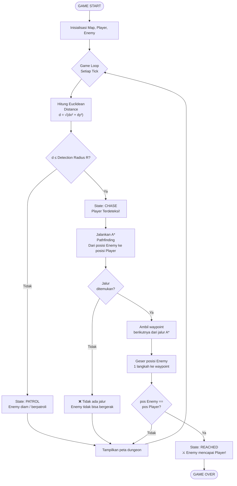
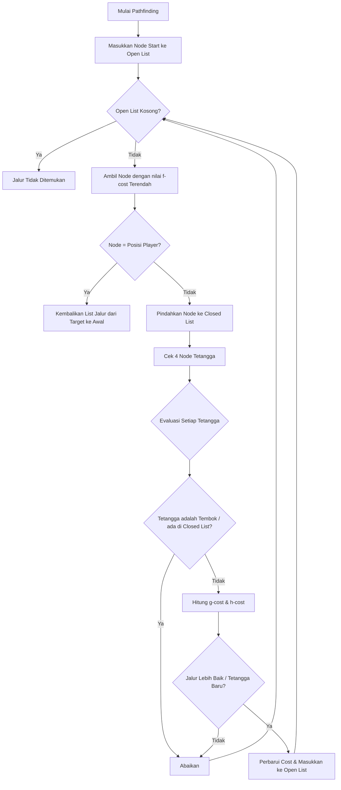

# Simulasi Enemy AI - Dungeon 2D Sederhana

Proyek ini adalah simulasi kecerdasan buatan (AI) musuh dalam game dungeon menggunakan Python. Musuh dirancang untuk bisa mendeteksi pemain, mengejar, mencari jalur untuk menghindari rintangan (tembok), dan menyerang jika sudah dekat.

## Algoritma yang Digunakan

1. **Finite State Machine (FSM)**
   FSM digunakan untuk mengatur perilaku dasar musuh melalui *state* atau fase. Terdapat tiga state utama:
   - **PATROL**: Musuh diam di tempat sambil terus memindai sekeliling.
   - **CHASE**: Musuh mendeteksi player dan akan mulai mencari jalan mendekati posisi player menggunakan algoritma pathfinding.
   - **REACHED**: Musuh telah mencapai posisi player dan game berakhir (Game Over).

2. **A* Pathfinding (A-Star)**
   Algoritma pencarian rute yang sangat optimal untuk mencari jalur terpendek dari posisi musuh menuju posisi player dengan menghindari tembok. 
   **Alasan Memilih A*:**
   A* menggabungkan keunggulan algoritma Dijkstra (menjamin rute terpendek) dan Greedy Best-First-Search (cepat karena dipandu oleh heuristik). Ini membuatnya sangat efisien, cepat, dan pintar dalam memandu musuh menyusuri labirin tanpa perlu mengecek semua jalur yang tak perlu.

3. **Pengecekan Jarak (Distance Checks)**
   Proyek ini menggunakan dua rumus pencarian jarak untuk keperluan berbeda:
   - **Jarak Euclidean**: Digunakan sebagai sensor radius berbentuk lingkaran (`detection_range`). Sesuai untuk mensimulasikan batas penglihatan sesungguhnya di dunia nyata.
   - **Jarak Manhattan**: Digunakan sebagai heuristik pada A* dan jarak serangan. Karena gerakan hanya terbatas pada 4 arah (atas, bawah, kiri, kanan), jarak langkah grid dihitung dengan Manhattan (tanpa diagonal).

---

## Flowchart Game Loop FSM

Berikut adalah cara kerja alur sistem dan state musuh (FSM) dalam setiap giliran / *tick*:



---

## Flowchart Pathfinding A*

Berikut adalah logika algoritma A* saat mencari jalan dari musuh menuju titik target:



---

## Cara Menjalankan Program

Program ini ditulis dengan standar library bawaan Python tanpa dependensi pihak ketiga, sehingga mudah langsung dijalankan di PC / Laptop.

1. Buka Terminal (Command Prompt / PowerShell / Bash).
2. Arahkan *directory* ke folder tempat Anda mengekstrak proyek ini.
3. Jalankan perintah berikut:

```bash
python enemy_ai.py
```
*(Catatan: pastikan Anda sudah menginstal Python)*
